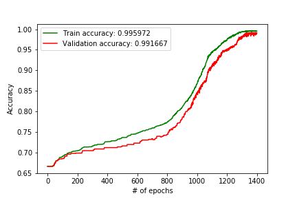

# Building a prediction tool for soccer matches of the German soccer league (Bundesliga) using feed-forward neural networks.
Soccer is by far the most prominent sports in Europe. Each country has its own, long-lived league and every weekend thousands of people gather together to watch their teams. Betting on the results of soccer matches is also quite popular. To make an educated guess about the result of a game, one has to look through various statistics that give insights into the teams current and past performance.
As this is a time consuming process, it is handy to let a computer do the heavy lifting and let it predict the result of a match!
In the last few years, the terms *Machine Learning* and *Neural Networks/Deep Learning* have become very popular. *Machine Learning* (https://en.wikipedia.org/wiki/Machine_learning) describes a set of algorithms that allow a computer to "learn" to solve a particular task, e.g classifying email into Spam or not Spam or predict the result of a soccer match. 
*Deep Learning* (https://en.wikipedia.org/wiki/Deep_learning) denotes a class of *Machine Learning* algorithms using artificial **Neural Networks** to accomplish the goal of "learning" how to solve a task with a computer. Artificial **Neural Networks** try to mimic the processes of firing neurons in the brain.
The process of learning a task is done by training the network on sample data (e.g giving labeled examples of Spam emails and non-Spam emails) to let the network detect on how to distinguish both classes.

Mathematically, the problem we try to solve is finding a function $f$ such that:
\begin{align}
f(X) & = Y \\
X: & \text{input (e.g a suitable representation of an email)} \\
Y: & \text{output (e.g a binary classification 0/1 for spam/not spam)}
\end{align}

As the real function $f$ that solves our problem perfectly is unknown, we search an approximation $\tilde{f}$ with:
$$f(X) \approx \tilde{f}(X), \forall X$$
During training we try to optimize $\tilde{f}$ to get closer to the real function $f$ using a loss function $L(f(X), \tilde{f}(X))$ that describes the discrepancies between the results of $f$ and $\tilde{f}$. This minimization is achieved by solving an optimization problem. We want to find parameters of $\tilde{f}$ (here weights in our neural network model) that minimize the value of our loss function.

Optimizing the weights of a neural network during training is done by using the Stochastic Gradient Descent algorithm (https://en.wikipedia.org/wiki/Stochastic_gradient_descent) to calculate the rate of change we should apply to the weights of the network to achieve a better fit to the expected outcome comapored to the outcome of the network. The process of applying these changes to the weights is done by Backpropagation in feed-forward networks (they propagate data in a single direction through the network = forward propagation) (https://www.coursera.org/learn/neural-networks-deep-learning/lecture/znwiG/forward-and-backward-propagation).

We use a Neural Network to represent our function $\tilde{f}$, to build a predictor for soccer matches. We train the network on historical match data. Match data of the Bundesliga can be obtained from: https://www.openligadb.de/.

We will use MXNet (https://mxnet.incubator.apache.org/) as framework for building our Neural Network based model and Panda DataFrames to store our training data (https://pandas.pydata.org/).

### Retrieving the training data
To be able to build a decent predictor for match results, we retrieve the match data of the years 2010 - 2017 from the API. The data is stored in a JSON format:

    for year in 2010 2011 2012 2013 2014 2015 2016 2017; 
    do curl -v -H "Accept: text/json" https://www.openligadb.de/api/getmatchdata/bl1/$year > matchdata$year.txt;     
    done
    
Additionally we load the rankings at the end of the season as well:

    for year in 2010 2011 2012 2013 2014 2015 2016 2017; 
    do curl -v -H "Accept: text/json" https://www.openligadb.de/api/getbltable/bl1/$year > table$year.txt;  
    done
    
Now that we have loaded all data in the JSON format, we need to prepare the data to be able to use them for training the network.

We use Panda DataFrames to easily load the JSON files:


```python
import numpy as np
import pandas as pd

def get_table(year):
    table_result = pd.read_json(table_data_directory + "/table" + str(year) + ".txt")
    table_result = table_result[["TeamName"]]
    table_result["Placement"] = table_result.index + 1
    return table_result
```

This will load the ranking data for the specified year into a Data Frame. The JSON format looks like:

    [
      {
        "TeamInfoId":40,
        "TeamName":"FC Bayern",
        "ShortName":"FCB",
        "TeamIconUrl":"https://upload.wikimedia.org/wikipedia/commons/thumb/0/0c/FC_Bayern_M%C3%BCnchen_Logo_2017.png/270px-FC_Bayern_M%C3%BCnchen_Logo_2017.png",
        "Points":81,
        "OpponentGoals":23,
        "Goals":88,
        "Matches":32,
        "Won":26,
        "Lost":3,
        "Draw":3,
        "GoalDiff":65
      }, ...
    ]
    
The data is sorted by the current rankings of the teams (here the first element if Bayern Munich, https://www.openligadb.de/api/getbltable/bl1/2017). We are interested in the TeamName only. Additionally we add the current ranking, we simply take the index of the team and increase it by one.

Now we have the complete list of teams for one season. As teams can change (the 2 last teams will go down to the 2nd leadua, and the 3rd last team will go into relegation). It is guaranteed that at least 2 teams change per season. So let's build up a list containing all teams of the seasons we are interested in


```python
def get_all_teams():
    teams_by_year = []
    for year in years:
        teams_by_year.append(get_table(year)["TeamName"].tolist())

    teams_by_year = np.array(teams_by_year).flatten()
    teams = pd.DataFrame(data = teams_by_year, columns = ["TeamName"]).drop_duplicates().reset_index(drop=True)
    return teams
```

Using the list of teams we can build up an encoder to represent a team by a vector. Neursl networks can take numerical vectors as inout only. Currently out teams are represented by a name. We could represent each team by a single number (e.g Bayern Munich = 1, 1. FC Köln = 2...), but this has been proven to impact the accuracy of the neural networks. By assigning natural numbers to teams we introduce a mathematical notion between teams. (E.g Bayern Munich < 1. FC Köln). This relation has no counterpart in the domain of soccer teams.
To overcome this issue, we will use a One-Hot encoding (https://hackernoon.com/what-is-one-hot-encoding-why-and-when-do-you-have-to-use-it-e3c6186d008f)
This encoding represents elements of k-element set as a vector of length k.
Each team is represented as a unit-vector in our k-dimensional vector space. k is the total number of teams we have encountered (+ 1 to deal with unknown teams).

We use the LabelBinarizer that performs a One-Hot encoding of labels, from the SciKit Learn library (http://scikit-learn.org/stable/):


```python
from sklearn.preprocessing import LabelBinarizer

def get_team_name(team, teams):
    if (team not in teams):
        return "unknown"
    else:
        return team

def get_encoder(teams):
    encoder = LabelBinarizer()
    encoder.fit(teams.tolist() + ["unknown"])
    return encoder
    
def encode_team(team, encoder):
    team_name = get_team_name(team, encoder.classes_)
    return encoder.transform([team_name])[0]
```

Now, we have a suitable representation of each team as a vector that can be used as input for the neural network.

Additionally to passing just the two team vectors as inout for the neural network, we also want to use the rank a team had at the end of the season as input. We compare both rankings and represent it as a 3-dimensional vector:
\begin{align}
(1,0,0) \iff rank(team1) < rank(team2) & \text{, team 1 is better than team 2} \\
(0,1,0) \iff rank(team1) \equiv rank(team2) & \text{, team 1 and team 2 have the same rank} \\
(0,0,1) \iff rank(team1) > rank(team2) & \text{, team 2 is better than team 1}
\end{align}


```python
def get_team_placement(team, year):
    table = get_table(year, from_file)
    team_placement = table.loc[table["TeamName"] == team.decode('utf-8')]
    if team_placement.empty:
        return 100 # team was not in BL1
    return team_placement["Placement"].values[0]

def compare_placements(placement_team_1, placement_team_2):
    if placement_team_1 < placement_team_2:
        return np.array([1, 0, 0])
    elif placement_team_1 == placement_team_2:
        return np.array([0, 1, 0])
    else:
        return np.array([0, 0, 1])
```

Now we have the final representation of our input for the neural network:

    [team 1 vector] + [team 2 vector] + [ranking comparison vector] (+ denotes concatenation)

###Loading match data
When taking a look at the format of a single match from the API, we see that the JSON this time is does not contain flat objects but multiple layers of hierarchy:
    
        {
        "MatchID":45742,
        "MatchDateTime":"2018-05-12T15:30:00",
        "TimeZoneID":"W. Europe Standard Time",
        "LeagueId":4153,
        "LeagueName":"1. Fußball-Bundesliga 2017/2018",
        "MatchDateTimeUTC":"2018-05-12T13:30:00Z",
        "Group":{
            "GroupName":"34. Spieltag",
            "GroupOrderID":34,
            "GroupID":28980
        },
        "Team1":{
            "TeamId":131,
            "TeamName":"VfL Wolfsburg",
            "ShortName":"VfL Wolfsburg",
            "TeamIconUrl":"https://upload.wikimedia.org/wikipedia/commons/thumb/f/f3/Logo-VfL-Wolfsburg.svg/20px-Logo-VfL-Wolfsburg.svg.png"
        },
        "Team2":{
            "TeamId":65,
            "TeamName":"1. FC Köln",
            "ShortName":"",
            "TeamIconUrl":"https://www.openligadb.de/images/teamicons/1_FC_Koeln.gif"
        },
        "LastUpdateDateTime":"2018-04-28T21:11:55.28",
        "MatchIsFinished":false,
        "MatchResults":[

        ],
        "Goals":[

        ],
        "Location":{
            "LocationID":20,
            "LocationCity":"Wolfsburg",
            "LocationStadium":"Volkswagen Arena "
        },
        "NumberOfViewers":null
    }
Unfortunately this prevents us from easily reading the data with Pandas. We have to do some parsing on our own. The data we are interested in is:
* the name of the home team
* the name of the away tem
* the goals of the home team
* the goals of the away team


```python
import json

def get_team_1(match_json):
    return match_json["Team1"]["TeamName"]

def get_team_2(match_json):
    return match_json["Team2"]["TeamName"]

def get_goals(match_json):
    goals_frame = pd.DataFrame.from_dict(match_json["MatchResults"])
    
    goals_frame = goals_frame.loc[goals_frame["ResultName"] == "Endergebnis"]
    
    return goals_frame[["PointsTeam1", "PointsTeam2"]].values[0]

def get_goals_team_1(match_json):
    goals = get_goals(match_json)
    
    return goals[0]

def get_goals_team_2(match_json):
    goals = get_goals(match_json)
    
    return goals[1]

def get_match_data(match_json):
    return [get_team_1(match_json), get_team_2(match_json), get_goals_team_1(match_json), get_goals_team_2(match_json)]

def parse_match_data(year):
    content = open(match_data_directory + "/matchdata" + str(2010) + ".txt", "r").read()
    content_json = json.loads(content)
    results = []
    for match_json in content_json:
        results.append(get_match_data(match_json) + [year])
        
    return pd.DataFrame(data = np.array(results), columns = ["Team1", "Team2", "GoalsTeam1", "GoalsTeam2", "Year"])
```

This will give us a data frame containing all matches for a season. Currently we have the teams as team names and the goals as numbers as well. We need to translate them into vectors (as described above to get our input data for our prediction model.

The output we want to predict with our model is the probability of one of the teams winning the game. Our prediction won't tell us the exact result of  match but who will win.

Based on the goals of both teams we have retrieved from the game data we define the game result as:
\begin{align}
(1,0,0) \iff goals(team1) > goals(team2) & \text{, team 1 show more goals than 2 (team 1 wins)} \\
(0,1,0) \iff goals(team1) \equiv goals(team2) & \text{, team 1 and team 2 have the number of goals, the game was a draw} \\
(0,0,1) \iff goals(team1) < goals(team2) & \text{, team 2 shot more goals than team 1 (team 2 wins)}
\end{align}

Again we do not use a single value (e.g we could have used $-1, 0, +1$ to distinguish the results, but another vector to avoid having a linear dependency between the different results (although it would not have been to dramatic here as we can interpret a $-1$ as team 1 loosing agains team 2, which is worse ($<$) than a draw ($0$), which is worse than winning ($+1$). However with this output structure we will be able to provide confidence scores of the system for a certain prediction quite easily.


```python
def flatten_data_frame(data_frame, column):
    new_data_frame = pd.DataFrame(data_frame[column].values.tolist())
    new_data_frame.columns = new_data_frame.columns.map(lambda x: str(x) + "_" + str(column))
    return data_frame.join(new_data_frame)

def parse_matches():
    match_data = []
    for year in years:
        match_data.append(parse_match_data(year))
        
    return pd.concat(match_data).reset_index(drop=True)
  
def compare_goals(goals_team_1, goals_team_2):
    if goals_team_1 > goals_team_2:
        return np.array([1, 0, 0])
    elif goals_team_1 == goals_team_2:
        return np.array([0, 1, 0])
    else:
        return np.array([0, 0, 1])

encoder = get_encoder(get_all_teams()["TeamName"].values)

def prepare_data():
    m = parse_matches()

    m["Team1Id"] = [encode_team(team_name.encode('utf-8'), encoder) for team_name in m["Team1"]]
    m["Team1Placement"] = [get_team_placement(team_data[0].encode('utf-8'), team_data[1]) for team_data in m[["Team1", "Year"]].values]
    m["Team2Id"] = [encode_team(team_name.encode('utf-8'), encoder) for team_name in m["Team2"]]
    m["Team2Placement"] = [get_team_placement(team_data[0].encode('utf-8'), team_data[1]) for team_data in m[["Team2", "Year"]].values]
    m["GameResult"] = [compare_goals(goals[0], goals[1]) for goals in m[["GoalsTeam1", "GoalsTeam2"]].values]
    m["Placements"] = [compare_placements(placements[0], placements[1]) for placements in m[["Team1Placement", "Team2Placement"]].values]

    m = flatten_data_frame(m, "Team1Id")
    m = flatten_data_frame(m, "Team2Id")
    m = flatten_data_frame(m, "Placements")
    m = flatten_data_frame(m, "GameResult")

    matches = m.drop(["Team1", "Team2", "GoalsTeam1", "GoalsTeam2", "Year", "Team1Placement", "Team2Placement", "Team1Id", "Team2Id", "Placements", "GameResult"], axis = 1)

    return matches
```

For each match, we retrieve the teams and the winner. This information is used to get  the rankings of the two competing teams. We represent all information as vectors (team id vectors, ranking comparison vector, result vector) and store them in a data frame.

##Building the prediction model
All match data we have retrieved from the API, now has been processed and we have vector representations of each match we want to use to train our model. Each match vector has a length 59 and the prediction is a 3-dimensional vector. Our model thus will take 59-dimensional vectors as input and return a 3-dimensional one.

We use a 4-layer feed-forward network (https://towardsdatascience.com/deep-learning-feedforward-neural-network-26a6705dbdc7) as model for our predictor. This means we have one input layer with 59 nodes. We will have two hidden layers and use a softmax output layer (https://www.quora.com/Artificial-Neural-Networks-Why-do-we-use-softmax-function-for-output-layer) that will squash the output into a 3-dimensional vector and will make sure that the sum of all 3 output values is $1$. Thus we can interpret the result as probabilities for each of the 3 cases (team 1 winning, draw, team 2 winning).


```python
import mxnet as mx

data = mx.symbol.Variable("data")
fc1 = mx.symbol.FullyConnected(data, name="fc1", num_hidden=64)
hidden1 = mx.symbol.Activation(fc1, name="hidden1", act_type="sigmoid")
fc2 = mx.symbol.FullyConnected(hidden1, name="fc2", num_hidden=128)
hidden2 = mx.symbol.Activation(fc2, name="hidden2", act_type="relu")
fc3 = mx.symbol.FullyConnected(hidden2, name="fc3", num_hidden=3)
softmax = mx.symbol.SoftmaxOutput(fc3, name="softmax") # sets loss function as cross-entropy loss

context = mx.cpu()
    
model = mx.mod.Module(symbol=softmax, context=context)
```

The first hidden layer consists of 64 nodes and uses a sigmoid (https://en.wikipedia.org/wiki/Sigmoid_function) as activation function. The activation function condenses the weighted sum of the nodes inputs into the range $\left[0,1\right]$. The next hidden layer has 128 nodes and uses a rectified linear as activation function.
$$f(x) = \max(0, x)$$
Comparing different activation functions for Neural Networks: https://medium.com/the-theory-of-everything/understanding-activation-functions-in-neural-networks-9491262884e0

##Training the prediction model
After setting up the model, preparing the data, we could start using the model to predict soccer match results. However, our model won't have a good performance, as we did not train it towards predicting soccer results. Training is usually done on huge data sets (e.g for handwritten digit classification (MNIST http://yann.lecun.com/exdb/mnist/), training corpuses have up to 60k training examples (labeled)), to achieve a good precision of the model. As the training operation is quite complex and is relatively slow, scaling the training to multiple machines is helful.

Neural networks require data that is annotated. They need the example input and the corresponding output. This is called *Supervised learning*. In our case, the training data consists of thr input vectors (team ids and placement) and the output vectors (match result). During training the network will receive the input vectors and will make a prediction. Then we apply our loss function and compare the expected outcome with the actual. This information is then used for optimizing the weights of the network.
We use a cross-entropy loss function (https://rdipietro.github.io/friendly-intro-to-cross-entropy-loss/) (by default when having a Softmax output layer in MXNet).
$$L(y,\tilde{y}) = - \sum_{i} y_i \log(\tilde{y}_i)$$


```python
BATCH_SIZE = 200

loaded_data = prepare_data()
Y = loaded_data[["0_GameResult", "1_GameResult", "2_GameResult"]].values
X = loaded_data.drop(["0_GameResult", "1_GameResult", "2_GameResult"], axis = 1).values

permutation = np.random.permutation(len(X))
    
X_shuffled = X[permutation]
Y_shuffled = Y[permutation]

evaluation_index = int(round(0.1 * len(X)))

X_train = X_shuffled[evaluation_index:]
Y_train = Y_shuffled[evaluation_index:]
X_test = X_shuffled[:evaluation_index]
Y_test = Y_shuffled[:evaluation_index]

train_iter = mx.io.NDArrayIter(data=X_train, label=Y_train, batch_size=BATCH_SIZE, shuffle=True)
test_iter = mx.io.NDArrayIter(data=X_test, label=Y_test, batch_size=BATCH_SIZE, shuffle=True)

model.fit(train_iter,
          eval_data=test_iter,
          optimizer='adam',
          optimizer_params={'learning_rate':0.02},
          eval_metric='acc',
          num_epoch=1400)
```

We split our training data into two sets: one for training and one for validation. This helps to calculate the precision of the model. One refrains from using the training data, as the model might overfit to the training data and this results in observing a high precision on the training data. However the performance on non-training data might be much worse.
Shuffling the datasets helps to break up orders between samples for training and also helps to improve the precision of the model.

For training the model we use the Adam optimizer (a variant of Stochastic Gradient Descent). A comparison of several optimization algorithms can be found: http://ruder.io/optimizing-gradient-descent/.
We train over 1400 epochs. This limits the number of iterations over the training data during the training phase. The learning rate describes the step size taken during training towards the optimal parameters. A value too small usually leads to very slow improvements during training. A value too big can lead to missing the optimal values.

The optimization algorithm, the learning rate and the number of epochs are called *hyper-parameters*, as they are independent of the model and are not touched during training finding the right values for them is either done by hand, or one could set up another optimization step to find the best values (e.g grid search).

The biggest risk during training is **overfitting**: https://machinelearningmastery.com/overfitting-and-underfitting-with-machine-learning-algorithms/.
This describes a situation where the model fits perfectly to the training data but then fails to fir other data than the training data. To prevent the model from overfitting and still be able to generalize well, usually a larger training dataset helps at it will contains more data (which increases variation in the dataset the model gets to see during training).
Another possibility is to tune a drop-out parameter that allows to drop random parameters of the network to zero.
This is designed to help the model to better generalize: https://medium.com/@amarbudhiraja/https-medium-com-amarbudhiraja-learning-less-to-learn-better-dropout-in-deep-machine-learning-74334da4bfc5.

##Training results



Our model is able to achieve an accuracy of ~99% on the training and on the validation dataset. One can see that over the course of training the accuracy increases constantly. After ~1200 epochs the accuracy curves start to flatten remain constant.


